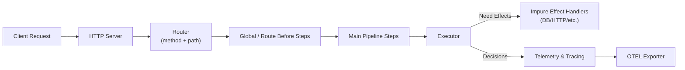

# Zerver


**Zerver is a backend framework for Zig that gives you X-ray vision into your API. It's built on the idea that observability isn't a feature you add later—it's the architecture.**

---

### Ten Reasons Why Zerver

1. **Trace-First Design:** Every request automatically emits a step-by-step timeline—no manual instrumentation required.
2. **Pure-Step Pipelines:** Business logic lives in deterministic, composable steps that are simple to test and reason about.
3. **Explicit Side Effects:** All I/O is declared via `.Need` decisions, making external dependencies transparent and auditable.
4. **Compile-Time Safety:** `CtxView` enforces read/write permissions at compile time, preventing accidental data leaks between steps.
5. **Typed Request State:** The slot system guarantees strongly typed per-request storage with arena-backed lifetimes.
6. **Production-Grade Observability:** Built-in OTEL exporter, span promotion, and structured logging surface bottlenecks automatically.
7. **Pluggable Orchestration:** Global and route-specific middleware chains compose cleanly without hidden control flow.
8. **Deterministic Error Semantics:** Structured error contexts feed the renderer and traces with actionable metadata.
9. **Future-Proof Runtime:** The MVP executor already speaks the same API the upcoming reactor/scheduler will use.
10. **Focused Developer Experience:** Request tests, slot docs, and example flows shorten the path from idea to production.

### Feature Snapshot

* ✅ Step-Oriented Request Processing: Define API logic as a pipeline of pure, composable steps. (Implemented)
* ✅ Decision-Based Control Flow: Steps return explicit Decision types (Continue, Need, Done, Fail) for clear orchestration. (Implemented)
* ✅ Built-in Observability (Automatic Tracing): Automatic generation of detailed request timelines and traces without manual instrumentation. (Implemented)
* ✅ OpenTelemetry (OTEL) Integration: Export traces to OTEL-compatible collectors with rich span attributes and events. (Implemented)
* ✅ Threshold-Based Span Promotion: Intelligently promote internal job events (e.g., queue waits, park durations) to dedicated OTEL spans based on configurable thresholds. (Implemented)
* ✅ Compile-Time `CtxView` Access Control: Enforce read/write permissions for request Slots at compile time, preventing data flow errors. (Implemented)
* ✅ Type-Safe `Slot` System: Manage per-request state in typed Slots, with SlotType mapping enum tags to Zig types. (Implemented)
* ✅ Explicit `Need` for Side Effects: Steps declare external I/O (DB, HTTP) as Effect requests, making side effects visible and traceable. (Implemented)
* ✅ Explicit Continuations: Define specific functions to resume request processing after effects complete. (Implemented)
* ✅ Arena-Per-Request Memory Management: Efficient, leak-free memory allocation for the lifetime of a single request. (Implemented)
* ✅ Modular Routing: Path matching with parameter support and priority-based route resolution. (Implemented)
* ✅ Global & Route-Specific Middleware Chains: Compose before steps for cross-cutting concerns. (Implemented)
* ✅ Comprehensive Error Model: Structured error types with context (what, key) and customizable error rendering. (Implemented)
* ✅ Synchronous MVP Executor: Current blocking execution model for effects, proving core concepts. (Implemented)
* 🚧 Non-Blocking I/O Reactor (Phase-2): Planned event-loop based system for asynchronous effect execution. (Planned)
* 🚧 Priority-Based Request Scheduling (Phase-2): Global effect queues with priority (interactive vs. batch) and work-stealing. (Planned)
* 🚧 Parallel Effect Execution (Phase-2): True concurrent execution of multiple effects within a Need decision. (Planned)
* 🚧 Static Pipeline Validation (Phase-2): Tooling to analyze Reads/Writes graphs for pipelines, flagging errors like read-before-write. (Planned)
* 🚧 Shared Memory for Large Payloads (OOP Plugins): Efficient transfer of large data between host and out-of-process plugins. (Planned)
* 🚧 Saga Compensations (Phase-3): Advanced rollback mechanisms for complex, multi-step transactions. (Planned)

### Architecture Overview



### Request Lifecycle (Port → Socket)

```mermaid
graph LR
    Port["listen(addr:port)"] --> Listener["Accept Connection"]
    Listener --> Arena["Init Request Arena / CtxBase"]
    Arena --> Parser["Parse Request & Headers"]
    Parser --> TelemetryStart["requestStart() Telemetry"]
    TelemetryStart --> PipelineSteps["Run Global/Route Steps"]
    PipelineSteps --> Exec["Executor.executeStep()"]
    Exec --> NeedBranch{"Decision == Need?"}
    NeedBranch -- Yes --> TaskSystem["Reactor Task System<br/>(queue step/effect jobs)"]
    TaskSystem --> EffectDispatch["Effect Dispatcher<br/>(DB/HTTP/etc.)"]
    EffectDispatch --> Resume["Resume Continuation Step"]
    Resume --> Exec
    NeedBranch -- No --> ResponseBuild["Build Response/Error"]
    ResponseBuild --> TelemetryEnd["requestEnd() Telemetry"]
    TelemetryEnd --> Writer["Serialize Response"]
    Writer --> Socket["Write to Socket"]
```



### Quickstart In Three Commands

```bash
# 1) Build the project
zig build

# 2) Run the blog CRUD example (includes slot usage, effects, continuations)
zig build run_blog

# 3) Hit an endpoint and inspect traces (uses built-in telemetry printer)
curl -i http://127.0.0.1:8080/blog/posts
```

**Alternative: Run Pre-built Binaries**

If you have pre-built binaries available (or if the build fails), you can run them directly:

```bash
# Run the blog CRUD example standalone
./zig-out/bin/blog_crud_example

# Or run the multi-process architecture:
./zig-out/bin/zingest    # HTTP ingest server (port 8080)
./zig-out/bin/zupervisor # Supervisor with hot reload

# Then test with:
curl -i http://127.0.0.1:8080/blog/posts
```

Need more detail? See `QUICKSTART.md` for environment setup, and `examples/blog_crud.zig` for a production-style flow using steps, slots, and effects.

### Feature Map Cheat Sheet

| Capability | Key Modules |
| --- | --- |
| Steps, Decisions, Effects | `src/zerver/core/types.zig`, `src/zerver/core/core.zig` |
| Request Context & Slots | `src/zerver/core/ctx.zig`, `docs/SLOTS.md` |
| Executor & Effect Handling | `src/zerver/impure/executor.zig` |
| HTTP Server & Routing | `src/zerver/impure/server.zig`, `src/zerver/routes/router.zig` |
| Observability & OTEL Export | `src/zerver/observability/telemetry.zig`, `src/zerver/observability/otel.zig` |
| Roadmap (Phase-2/3) | `docs/SPEC.md`, `docs/PLUGINS.md` |

## 1. Why Zerver? The Problem & The Solution

Every production incident starts with a question you can't easily answer: "Why is this endpoint slow?" "Did the payment go through?" "Which microservice is failing?" In traditional frameworks, you're often left guessing, littering your code with logs, or spending hours correlating traces across disparate systems.

Consider a typical checkout endpoint:

```javascript
// Express.js, Gin, Actix... they all look similar
app.post('/checkout', async (req, res) => {
    const user = await auth.verify(req);        // How long did this take?
    const cart = await db.getCart(user.id);     // Was this cached?
    const payment = await stripe.charge(cart);  // Did this retry?
    const order = await db.createOrder(cart);   // Did this deadlock?
    await email.sendReceipt(order);             // Did this fail silently?
    res.json({ order });
});
```

When this is slow, you're flying blind. You don't know if `auth` called an external service, if the DB query was queued, or if `Stripe` timed out and retried multiple times.

**Zerver's Solution: A Framework That Tells You What Happened, Automatically.**

In Zerver, you define your logic as a series of pure, composable steps. The framework orchestrates them and performs I/O on your behalf. When your flow runs, Zerver produces a detailed, actionable trace **automatically**, without manual instrumentation.

```
Request: POST /checkout [req_7a8f3c2b]
Timeline:
  0.0ms  auth.verify        ✓ 0.15ms  (cpu)
  0.2ms  cart.load          → dbGet(cart:u_123)
  2.8ms  cart.load          ✓ 2.6ms   (io: postgres)
  2.8ms  payment.charge     → httpPost(stripe.com/charges)
  45ms   payment.charge     ⚠ retry 1/1 (timeout)
  89ms   payment.charge     ✓ 86.2ms  (io: stripe, total: 44+86=130ms)
  89ms   order.create       → dbPut(order:o_456)
  95ms   order.create       ✓ 6ms     (io: postgres)
  95ms   email.send         → httpPost(sendgrid.com) [optional]
  96ms   render.success     ✓ 0.1ms   (cpu)

🔴 SLOW: payment.charge took 130ms (timeout + retry)
   └─ Stripe latency P99: 45ms → 89ms (2x normal)
```

You immediately know the root cause: Stripe timed out and retried. This dramatically reduces Mean Time To Resolution (MTTR) for incidents and provides unparalleled clarity into your API's behavior.

---

## 2. High-Level Architecture: How Zerver Works

Zerver is fundamentally designed as a **job scheduler with an HTTP frontend**. It enforces a strict separation between pure business logic and impure runtime operations, enabling built-in observability and robust orchestration.

1.  **HTTP Requests** are received and parsed by the server.
2.  Requests are routed to a defined **pipeline** of **Steps**.
3.  **Steps** are pure functions that operate on a request context (`CtxBase` or `CtxView`) and return a `Decision`.
4.  A `Decision` can be:
    *   `.Continue`: Proceed to the next step.
    *   `.Done(Response)`: The request is complete, send a response.
    *   `.Fail(Error)`: The request failed, trigger error handling.
    *   `.Need(Effect)`: The step requires an external side effect (I/O, compute, etc.).
5.  When a step returns `.Need`, the framework's **Executor** takes over. In Phase-2, this involves handing off the effect to a non-blocking **I/O Reactor** (e.g., `libuv` or `io_uring`) and freeing the current worker thread.
6.  Upon completion of the effect, a **Continuation** (another step) is scheduled to resume the request flow, potentially on a different worker.

This architecture ensures that CPU-bound work (steps) never blocks I/O, leading to high throughput and predictable tail latency, even under heavy load.

---

## 3. DX Notes: Developer Experience & Core Principles

Zerver's design prioritizes developer experience by making complex system behaviors explicit and leveraging Zig's powerful `comptime` features.

### Explicit is Better Than Implicit

*   **Clear Control Flow:** Steps explicitly declare their intent via `Decision` types. There's no hidden `await` or implicit side effects. Every interaction with external systems (database, HTTP APIs) must be requested as an `Effect` via a `.Need` decision.
*   **Testability:** Pure steps are easy to unit test in isolation, as their behavior is deterministic given their inputs. The `ReqTest` harness facilitates this by allowing direct invocation and state seeding.
*   **Orchestration:** Complex workflows are defined as linear pipelines of steps, making them easy to read, reason about, and debug.

### Compile-Time Confidence

Zerver leverages Zig's `comptime` to catch errors before runtime, preventing entire classes of bugs.

*   **Type-Safe State Management with Slots:** Per-request state is managed through a `Slot` system. Each `Slot` has a defined type (`SlotType`).
*   **`CtxView` for Access Control:** Steps declare their read/write access to `Slots` using a `CtxView`. If a step attempts to `require` a `Slot` it hasn't declared access to, or if a `Slot` is read before it's written, **the code will not compile**. This eliminates null pointer exceptions, ensures data dependencies are met, and prevents accidental state manipulation.

### Composable & Reusable Logic

Steps are like Lego bricks. You can assemble them into chains and pipelines to build complex features. A platform team can publish shared, audited step chains (e.g., for authentication or rate limiting) that product teams can compose into their routes, ensuring consistency and reducing boilerplate.

### Observable by Design

Every step execution, effect request, and continuation is automatically recorded and correlated into a request timeline. This means:

*   **No Manual Instrumentation:** You get detailed traces without adding a single line of logging or tracing code to your business logic.
*   **Reduced Debugging Time:** Instantly pinpoint performance bottlenecks, retry attempts, and failure points across your entire request flow.
*   **Deterministic Replay (Future):** The explicit nature of steps and effects lays the groundwork for replaying request timelines for advanced debugging and incident analysis.

---

## 4. Comptime Concepts: Deep Dive into Zig's Power

Zig's `comptime` (compile-time) features are fundamental to Zerver's design, enabling powerful static analysis and code generation that enhance safety and developer experience.

*   **`CtxView` Generation:** The `CtxView(spec)` function in `src/zerver/core/ctx.zig` is a prime example. At compile-time, it inspects the `spec` (which defines `reads` and `writes` for `Slots`) and generates a specialized context type. This generated type's `require()`, `optional()`, and `put()` methods include `comptime` checks that emit `@compileError` if a step attempts to access a slot it hasn't declared or write to a read-only slot.
*   **Step Trampolines:** The `zerver.step(name, F)` helper in `src/zerver/core/core.zig` creates a generic `Step` object from a user-defined function `F`. If `F` expects a `CtxView`, `comptime` code generates a small "trampoline" function that adapts the generic `*CtxBase` (passed by the executor) into the specific `*CtxView` required by `F`. This allows the executor to interact with all steps uniformly while preserving strong type-checking for the step's internal logic.
*   **Slot ID Conversion:** `comptime` is used to convert `Slot` enum tags into `u32` identifiers for efficient runtime storage in `CtxBase`'s `std.AutoHashMap`. This ensures that the human-readable enum names are mapped to compact integer keys without runtime overhead.

These `comptime` mechanisms are crucial for Zerver's promise of "Compile-Time Confidence," shifting many common runtime errors to compile-time failures.

---

## 5. Example Handler: A Glimpse into Zerver Code

Here's a simplified example of a Zerver step that loads a blog post from a database and then renders its content.

```zig
// Define the slots for blog-related state
pub const BlogSlot = enum(u32) {
    PostId,    // ID of the post being requested
    PostJson,  // Raw JSON content of the post from DB
    Post,      // Parsed Post struct
};

// Map each slot to its Zig type
pub fn BlogSlotType(comptime s: BlogSlot) type {
    return switch (s) {
        .PostId => []const u8,
        .PostJson => []const u8,
        .Post => struct { id: []const u8, title: []const u8, content: []const u8 },
    };
}

// Define a CtxView for this step: reads PostId, writes PostJson
const LoadPostView = zerver.CtxView(.{
    .slotTypeFn = BlogSlotType,
    .reads = &.{BlogSlot.PostId},
    .writes = &.{BlogSlot.PostJson},
});

// Step to load a blog post from the database
pub fn step_load_blog_post(ctx_base: *zerver.CtxBase) !zerver.Decision {
    // Adapt CtxBase to our typed CtxView
    const ctx = LoadPostView{ .base = ctx_base };

    // Safely require the PostId from the context (compile-time checked)
    const post_id = try ctx.require(BlogSlot.PostId);

    // Request a database GET effect
    return .Need(.{
        .effects = &.{
            zerver.Effect.dbGet(.{
                .key = ctx.base.bufFmt("posts/{s}", .{post_id}), // Construct DB key
                .token = @intFromEnum(BlogSlot.PostJson),       // Store result in PostJson slot
                .required = true,
            }),
        },
        .mode = .Sequential,
        .join = .all,
        .continuation = continuation_render_post, // Resume here after DB call
    });
}

// Define a CtxView for the continuation: reads PostJson, writes Post
const RenderPostView = zerver.CtxView(.{
    .slotTypeFn = BlogSlotType,
    .reads = &.{BlogSlot.PostJson},
    .writes = &.{BlogSlot.Post},
});

// Continuation step to parse the JSON and render the page
fn continuation_render_post(ctx_base: *zerver.CtxBase) !zerver.Decision {
    const ctx = RenderPostView{ .base = ctx_base };

    // Get the raw JSON from the slot
    const post_json = (try ctx.optional(BlogSlot.PostJson)) orelse {
        return zerver.fail(zerver.ErrorCode.NotFound, "blog_post", "not_found");
    };

    // Parse the JSON into a Post struct
    const parsed_post = try ctx.base.json(BlogSlotType(BlogSlot.Post), post_json);
    try ctx.put(BlogSlot.Post, parsed_post); // Store parsed struct in slot

    // Now render the HTML response using the parsed post data
    // (Simplified for brevity, actual rendering would use HTML components)
    const html_body = ctx.base.bufFmt("<h1>{s}</h1><p>{s}</p>", .{parsed_post.title, parsed_post.content});

    return zerver.done(.{
        .status = zerver.HttpStatus.ok,
        .body = .{ .complete = html_body },
        .headers = &[_]zerver.Header{
            .{ .name = "Content-Type", .value = "text/html; charset=utf-8" },
        },
    });
}
```

This example demonstrates:
*   **Slot-based state:** `PostId`, `PostJson`, `Post` are defined as `BlogSlot` enum members.
*   **`CtxView`:** `LoadPostView` and `RenderPostView` explicitly declare what they read and write, enforced at compile-time.
*   **`Need` for effects:** `step_load_blog_post` requests a `dbGet` operation.
*   **`continuation`:** `continuation_render_post` is called after the database effect completes.
*   **`CtxBase` helpers:** `bufFmt` for string formatting and `json` for JSON parsing.

---

## 6. Notes on OTEL: Built-in Observability

Zerver's core architecture is built around observability, providing rich tracing capabilities out-of-the-box, deeply integrated with the OpenTelemetry (OTEL) standard. This provides the "X-ray vision" into your API's behavior.

Here's a distilled view of a sample OTEL trace for a `GET /blogs/posts/:id` request, illustrating the hierarchical structure and key data captured:

```
Span: GET /blogs/posts/1761255922598060600 (SERVER)
  Attributes:
    http.method: GET
    http.route: /blogs/posts/1761255922598060600
    zerver.request_id: bfc7a512562313e06f198a58ae9018f8
    zerver.outcome: Done
    http.status_code: 200
    // ... other HTTP and Zerver request attributes

  Events:
    zerver.need_scheduled (need.sequence: 1, need.effect_count: 1, need.mode: Sequential, need.join: all)
    zerver.continuation_resume (need.sequence: 1, resume.ptr: ...)
    // ... job lifecycle events for continuation

  Children:
    Span: route_match (INTERNAL)
      Attributes:
        step.name: route_match
        step.layer: system
        step.sequence: 1
        step.outcome: Continue

    Span: load_blog_post_page (INTERNAL)
      Attributes:
        step.name: load_blog_post_page
        step.layer: main
        step.sequence: 2
        step.outcome: Done

      Children:
        Span: db_get (CLIENT)
          Attributes:
            effect.kind: db_get
            effect.token: 8
            effect.target: posts/1761255922598060600
            effect.success: true
            effect.duration_ms: 2
            effect.bytes: 146
            // ... other effect attributes

          Events:
            zerver.effect_job_enqueued (job.queue: effector_jobs, job.stage: enqueued)
            zerver.effect_job_started (job.queue: effector_jobs, job.stage: started, job.worker_index: 3)
            zerver.effect_job_completed (job.queue: effector_jobs, job.stage: completed, job.success: true)

          Children:
            Span: effect_job (INTERNAL) - Promoted due to thresholds
              Attributes:
                job.type: effect
                job.queue_wait_ms: 0
                job.run_active_ms: 1
                job.total_ms: 1
                job.success: true
                // ... other job metrics
              Events: [ /* ... detailed job lifecycle events ... */ ]

        Span: continuation_job (INTERNAL) - Promoted due to thresholds
          Attributes:
            job.type: continuation
            job.queue_wait_ms: 0
            job.run_active_ms: 2
            job.total_ms: 2
            job.decision: Done
            // ... other job metrics
          Events: [ /* ... detailed job lifecycle events ... */ ]
```

Key aspects of Zerver's OTEL integration:

*   **Hierarchical Spans:** The trace starts with a root `SERVER` span for the incoming HTTP request. Internal steps (`route_match`, `load_blog_post_page`) are represented as `INTERNAL` children. External calls like `db_get` are `CLIENT` spans.
*   **Rich Attributes:** Each span is enriched with relevant attributes: `http.method`, `http.route`, `zerver.request_id`, `zerver.outcome`, `step.name`, `effect.kind`, `effect.target`, `effect.duration_ms`, and more. This provides deep context for every operation.
*   **Job Lifecycle Events:** Within spans, `events` track the precise lifecycle of internal jobs (e.g., `zerver.effect_job_enqueued`, `zerver.effect_job_started`, `zerver.effect_job_completed`). These events include queue names, worker IDs, and success/failure status.
*   **Threshold-Based Span Promotion:** Zerver intelligently promotes internal job events (like `effect_job` and `continuation_job`) to their own dedicated `INTERNAL` spans if their queueing or execution time exceeds configurable thresholds. This allows you to zoom into the scheduler's behavior and identify bottlenecks like long queue waits or excessive parking durations, without cluttering every trace with micro-details.
*   **Structured Logging (`slog`):** All internal logging uses a structured logging library (`src/zerver/observability/slog.zig`) that can output human-readable or JSON formats, making it easy to integrate with log aggregation systems.

This deep integration with OTEL means you spend less time instrumenting and more time building, with confidence that you'll have the data needed to understand and debug your production systems.

---

## Project Status: MVP Implementation Complete ✅

Zerver is now in **active development** with a working MVP. The core concepts, API surface, and architectural roadmap are implemented. The synchronous MVP proves the developer experience and debugging benefits.

Phase-2 will introduce the non-blocking I/O reactor and priority scheduler. The MVP API is fully compatible with Phase-2 enhancements.

We welcome discussion, feedback, and contributions on the design. Please review the documentation in `docs/` and open an issue to share your thoughts.

---

## Configuration

Runtime settings live in `config.json`. The file now centralises:

-   Database driver, file path, pool size, and busy timeout
-   Blocking thread pool sizing for legacy/middleware work
-   Reactor pools (continuation workers, effector workers, compute pool type/size)
-   HTTP server bind address
-   Observability endpoints and Tempo auto-detection

Tuning pool sizes here avoids recompilation; `runtime/config.zig` loads the `reactor` section and feeds those values into the job and task systems during startup.

---

## Full Example: Blog CRUD API

For a complete, runnable example demonstrating all of Zerver's core features working together, see [`examples/blog_crud.zig`](examples/blog_crud.zig).

This example showcases:
-   **Slot system** with typed per-request state
-   **CtxView** with compile-time slot access restrictions
-   **Steps** with effects (real SQLite DB operations)
-   **Continuations** and join strategies
-   **Error handling**
-   A complete request/response cycle for a CRUD API, including HTML rendering with HTMX.

It's the best place to see how Zerver's principles translate into a functional application.

---

## Code Structure and Rationale

The Zerver project is organized to clearly separate core framework logic from examples and documentation, promoting modularity and ease of understanding.

-   **`src/`**: Contains the core Zerver framework source code.
    -   **`src/zerver/core/`**: Fundamental building blocks of the Zerver framework, including `Ctx` (context management), `reqtest` (request testing utilities), and `types` (common data structures). This is where the core abstractions reside.
    -   **`src/zerver/impure/`**: Components that interact with the outside world or manage side effects, such as the `executor` (for handling effects) and the `server` (HTTP server implementation). This separation highlights the framework's pure-step philosophy.
    -   **`src/zerver/observability/`**: Contains tracing and observability related code, like the `tracer`.
    -   **`src/zerver/runtime/`**: Low-level runtime components, including the reactor, scheduler, and platform-specific utilities.
    -   **`src/zerver/routes/`**: Logic for defining and managing API routes.
    -   **`src/zerver/sql/`**: Database abstraction layer and drivers.
    -   **`src/features/`**: Example feature implementations (todos, blog, hello).
    -   **`src/zerver/shared/`**: Reusable components like HTML rendering helpers.

-   **`examples/`**: Demonstrates how to use the Zerver framework with various practical scenarios. Each example is designed to showcase specific features or common use cases, like the `todo_crud.zig` example.

-   **`docs/`**: Comprehensive documentation, design specifications, and internal notes. This directory serves as a knowledge base for understanding the framework's design decisions and future plans.

This structure emphasizes Zerver's core principles by clearly delineating pure logic from impure operations and providing dedicated spaces for examples and documentation.

---

## Contributing

We welcome contributions! Please see [CONTRIBUTING.md](CONTRIBUTING.md) for guidelines on how to get started, development setup, and contribution workflow.
