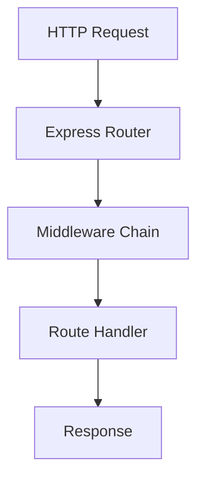
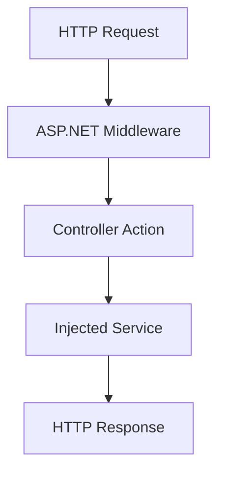
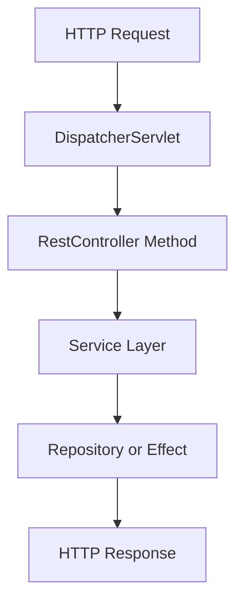
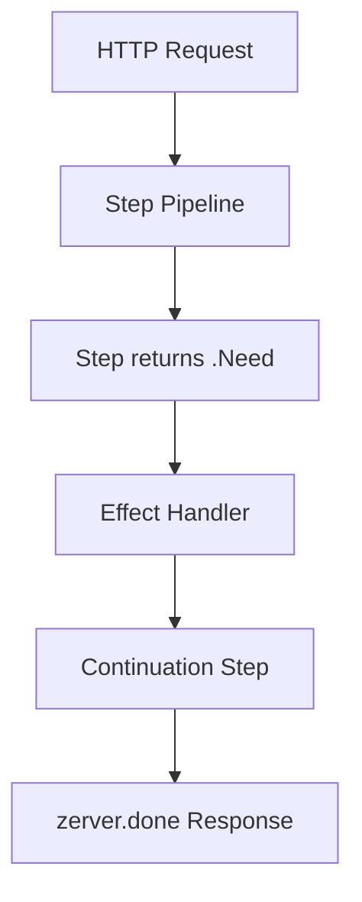

# To-Do Controller Comparison: Express, ASP.NET, Spring Boot, Zerver

This note contrasts how the same "To-Do" resource is modeled in four popular backend stacks. Each example covers the same operations (list, fetch by id, create, update, delete) so you can compare mental models, code structure, and the way each framework handles request flow.

| Framework | Primary Abstraction | Composition Model | Where Business Rules Live | Built-in Observability |
|-----------|---------------------|-------------------|---------------------------|------------------------|
| Express.js (Node) | Functions wired into middleware chain | Manual ordering of middleware and handlers | Inline inside route handlers or extracted helper modules | Minimal; logs/tracing added manually |
| ASP.NET Core (.NET) | Controller class with attribute routing | DI container builds controllers, filters run around actions | Service classes injected into controller | Rich logging/metrics pipeline, but opt-in by configuration |
| Spring Boot (Java) | `@RestController` backed by Spring context | Declarative annotations, filters/interceptors wrap handlers | `@Service` beans injected; validation via annotations | Actuator & Micrometer integration, requires enabling |
| Zerver (Zig) | Step pipeline declared per route | Compile-time validated step graph, explicit effects | Pure steps manipulate typed request slots | Tracing and context propagation built into core engine |

## Express.js (Node)

**Mental model:** Express exposes a lightweight HTTP pipeline. You compose middleware until you respond. State and validation are whatever you make them - usually JavaScript objects held in closure scope or attached to `req`.

**DX highlights:**
- Extremely low ceremony to get started; the todo router above fits in one file with no project scaffolding.
- Freedom cuts both ways: developers must align on linting, validation, and result shaping or the API drifts quickly.
- Async flows are easy to write but hard to introspect; figuring out why a handler stalled requires manual timing, logs, or third-party middleware.

**Contrast with Zerver:** Express gives you full control and minimal opinions, whereas Zerver trades some freedom for explicit step graphs and enforced data flow. In Zerver every step has a name, runs in a known order, and produces trace events, so a stalled request is visible without extra instrumentation.



```ts
// src/todos/controller.ts
import { Router, Request, Response } from 'express';

interface Todo {
  id: string;
  title: string;
  completed: boolean;
}

const todos = new Map<string, Todo>();

const router = Router();

router.get('/todos', (_req: Request, res: Response) => {
  res.json(Array.from(todos.values()));
});

router.get('/todos/:id', (req, res) => {
  const todo = todos.get(req.params.id);
  if (!todo) return res.status(404).json({ error: 'Not found' });
  res.json(todo);
});

router.post('/todos', (req, res) => {
  const todo: Todo = { id: crypto.randomUUID(), completed: false, ...req.body };
  todos.set(todo.id, todo);
  res.status(201).json(todo);
});

router.patch('/todos/:id', (req, res) => {
  const existing = todos.get(req.params.id);
  if (!existing) return res.status(404).json({ error: 'Not found' });
  const updated = { ...existing, ...req.body };
  todos.set(updated.id, updated);
  res.json(updated);
});

router.delete('/todos/:id', (req, res) => {
  todos.delete(req.params.id);
  res.status(204).end();
});

export default router;
```

- **Composition:** Manual - middleware order in code equals runtime order.
- **State handling:** Data is mutable JS objects; validation and error handling are ad-hoc.
- **Observability:** Add logging/tracing middleware yourself (e.g. `morgan`, OpenTelemetry SDK).

## ASP.NET Core (.NET)

**Mental model:** HTTP requests become controller instances resolved by the dependency injection container. Attributes declare routing and filters/policies run before/after each action. Model binding populates strongly typed parameters.

**DX highlights:**
- Tooling (Visual Studio, Rider) scaffolds controllers, contracts, and integration tests; refactors are safe because everything is typed and IDE-aware.
- Cross-cutting concerns (auth, rate limiting, caching) bolt in through filters and middleware; they are powerful but require familiarity with the ASP.NET pipeline.
- Observability is available via `ILogger`, `ActivitySource`, and OpenTelemetry integration, yet you still need to wire log scopes and tags in every controller or service.

**Contrast with Zerver:** ASP.NET relies on runtime DI and attributes, so the pipeline emerges at runtime. Zerver keeps the pipeline declarative and finite (array of steps) which the executor can validate and trace. Instead of action filters, you add pre-steps that manipulate slots or signal `.Need`, and every piece of state is type-checked.



```csharp
// TodoApi/Controllers/TodosController.cs
using Microsoft.AspNetCore.Mvc;

namespace TodoApi.Controllers;

[ApiController]
[Route("api/[controller]")]
public sealed class TodosController : ControllerBase
{
    private readonly ITodoService _service;

    public TodosController(ITodoService service)
    {
        _service = service;
    }

    [HttpGet]
    public async Task<ActionResult<IEnumerable<Todo>>> ListAsync() =>
        Ok(await _service.ListAsync());

    [HttpGet("{id}")]
    public async Task<ActionResult<Todo>> GetAsync(Guid id)
    {
        var todo = await _service.GetAsync(id);
        return todo is null ? NotFound() : Ok(todo);
    }

    [HttpPost]
    public async Task<ActionResult<Todo>> CreateAsync([FromBody] CreateTodoDto dto)
    {
        var todo = await _service.CreateAsync(dto);
        return CreatedAtAction(nameof(GetAsync), new { id = todo.Id }, todo);
    }

    [HttpPatch("{id}")]
    public async Task<ActionResult<Todo>> UpdateAsync(Guid id, [FromBody] UpdateTodoDto dto)
    {
        var todo = await _service.UpdateAsync(id, dto);
        return todo is null ? NotFound() : Ok(todo);
    }

    [HttpDelete("{id}")]
    public async Task<IActionResult> DeleteAsync(Guid id)
    {
        var removed = await _service.DeleteAsync(id);
        return removed ? NoContent() : NotFound();
    }
}
```

- **Composition:** Filters, middleware, and DI container orchestrate cross-cutting concerns.
- **State handling:** Strongly typed models with validation attributes; DTOs shield domain objects.
- **Observability:** Logging, metrics, diagnostics configured via `Program.cs`/appsettings.

## Spring Boot (Java)

**Mental model:** Controllers are plain classes registered as beans. Spring binds HTTP input to Java objects, injects dependencies, and applies cross-cutting behavior (validation, transactions) through annotations.

**DX highlights:**
- Annotation-driven features (validation, transactions, caching) reduce boilerplate, but debugging annotation chains can feel opaque to newcomers.
- Spring DevTools, Actuator, and the ecosystem ecosystem (Spring Data, Security) make building production-grade services fast once the context is configured.
- Observability defaults improved with Micrometer, but you still decide which timers and spans to emit; forgetting a `@Timed` or `@Observed` leaves gaps.

**Contrast with Zerver:** Spring hides orchestration inside the container; Zerver exposes it. In Zerver you never wonder "which filter ran first" because the step array is the pipeline. Where Spring wraps your method to handle transactions and retries, Zerver has explicit steps that yield `.Need` for each effect, making side effects part of the flow definition.



```java
// src/main/java/com/example/todo/TodoController.java
package com.example.todo;

import org.springframework.http.ResponseEntity;
import org.springframework.web.bind.annotation.*;

import java.net.URI;
import java.util.List;
import java.util.UUID;

@RestController
@RequestMapping("/todos")
public class TodoController {

    private final TodoService service;

    public TodoController(TodoService service) {
        this.service = service;
    }

    @GetMapping
    public List<Todo> list() {
        return service.list();
    }

    @GetMapping("/{id}")
    public ResponseEntity<Todo> get(@PathVariable UUID id) {
        return service.get(id)
                .map(ResponseEntity::ok)
                .orElse(ResponseEntity.notFound().build());
    }

    @PostMapping
    public ResponseEntity<Todo> create(@RequestBody CreateTodoRequest request) {
        Todo todo = service.create(request);
        return ResponseEntity
                .created(URI.create("/todos/" + todo.id()))
                .body(todo);
    }

    @PatchMapping("/{id}")
    public ResponseEntity<Todo> update(@PathVariable UUID id, @RequestBody UpdateTodoRequest request) {
        return service.update(id, request)
                .map(ResponseEntity::ok)
                .orElse(ResponseEntity.notFound().build());
    }

    @DeleteMapping("/{id}")
    public ResponseEntity<Void> delete(@PathVariable UUID id) {
        return service.delete(id)
                ? ResponseEntity.noContent().build()
                : ResponseEntity.notFound().build();
    }
}
```

- **Composition:** Dependency injection plus aspect-oriented features (validation, transactions).
- **State handling:** Java records/classes with Bean Validation; persistence via JPA repositories.
- **Observability:** Enable Spring Actuator + Micrometer for metrics/traces; not automatic by default.

## Zerver (Zig)

**Mental model:** Requests run through a compile-time checked pipeline of "steps." Each step explicitly declares what request slots it reads/writes. Effects (DB, HTTP) are requested via `Need` decisions and executed by the engine, while observability is captured automatically.

**DX highlights:**
- Step signatures advertise the data contract (reads, writes) so reviewers can spot ordering mistakes without running the code.
- Returning `.Need` is the only way to execute side effects, which keeps I/O explicit and traceable; the executor records both the request and the continuation hop.
- Trace export, slot inspection, and effect timelines come for free because the engine controls scheduling.



```zig
// src/todo/controller.zig
const std = @import("std");
const zerver = @import("zerver");

const Slot = enum { TodoId, TodoList, TodoItem, TodoPayload };

fn SlotType(comptime s: Slot) type {
    return switch (s) {
        .TodoId => []const u8,
        .TodoList => []const struct { id: []const u8, title: []const u8, completed: bool },
        .TodoItem => struct { id: []const u8, title: []const u8, completed: bool },
        .TodoPayload => struct { title: []const u8, completed: bool = false },
    };
}

fn step_capture_id(ctx: *zerver.CtxView(.{ .writes = &.{ .TodoId } })) !zerver.Decision {
    const id = ctx.param("id") orelse {
        return zerver.fail(400, "Missing :id parameter", "path");
    };
    try ctx.put(.TodoId, id);
    return zerver.continue_();
}

fn step_list_todos(ctx: *zerver.CtxView(.{ .writes = &.{ .TodoList } })) !zerver.Decision {
    const todos = [_]SlotType(.TodoItem){
        .{ .id = "todo-1", .title = "First", .completed = false },
        .{ .id = "todo-2", .title = "Second", .completed = true },
    };
    try ctx.put(.TodoList, todos[0..]);
    return zerver.continue_();
}

fn step_render_list(ctx: *zerver.CtxView(.{ .reads = &.{ .TodoList } })) !zerver.Decision {
    const list = try ctx.require(.TodoList);
    const body = try std.json.stringifyAlloc(ctx.base.allocator, list, .{});
    return zerver.done(.{ .status = 200, .body = body });
}

pub fn registerTodos(server: *zerver.Server) !void {
    try server.addRoute(.GET, "/todos", .{
        .steps = &.{
            zerver.step("load_list", step_list_todos),
            zerver.step("render_list", step_render_list),
        },
    });

    try server.addRoute(.GET, "/todos/:id", .{
        .steps = &.{
            zerver.step("read_path", step_capture_id),
            zerver.step("load_one", step_load_todo),
            zerver.step("render_one", step_render_todo),
        },
    });
    // Similar pipelines for POST, PATCH, DELETE with explicit validation + effect steps.
}
```

- **Composition:** Static array of steps; the executor enforces declared read/write slots.
- **State handling:** Strongly typed slots guarantee data dependencies are explicit.
- **Observability:** Every step/effect is traced with timing and context without extra code.

### Zerver step examples (continued)

```zig
fn step_load_todo(ctx: *zerver.CtxView(.{
    .reads = &.{ .TodoId },
    .writes = &.{ .TodoItem },
})) !zerver.Decision {
    const id = try ctx.require(.TodoId);
    const resume = zerver.step("cache_hit", step_record_hit);
    return .Need(.{
        .effects = &.{
            zerver.Effect.dbGet(.{
                .key = ctx.base.bufFmt("todo:{s}", .{id}),
                .required = true,
                .token = .TodoItem,
            }),
        },
        .resume = resume,
    });
}

fn step_record_hit(ctx: *zerver.CtxView(.{
    .reads = &.{ .TodoId, .TodoItem },
    .writes = &.{ .TodoItem },
})) !zerver.Decision {
    const item = try ctx.require(.TodoItem);
    // mutate or enrich the todo before rendering
    try ctx.put(.TodoItem, .{ .id = item.id, .title = item.title, .completed = item.completed });
    return zerver.continue_();
}

fn step_render_todo(ctx: *zerver.CtxView(.{ .reads = &.{ .TodoItem } })) !zerver.Decision {
    const todo = try ctx.require(.TodoItem);
    const body = try std.json.stringifyAlloc(ctx.base.allocator, todo, .{});
    return zerver.done(.{ .status = 200, .body = body });
}
```

## Mental Model Takeaways

- **Control flow:** Express relies on imperative ordering; ASP.NET/Spring declare metadata and let the runtime shape the pipeline; Zerver makes the pipeline explicit and type-checked.
- **State & validation:** JavaScript solutions require discipline, .NET/Spring leverage attributes and DI, while Zerver encodes data flow via slots to catch mistakes at compile time.
- **Side effects:** Express hides them in async functions; ASP.NET/Spring split side effects across services/repositories; Zerver forces every effect to be declared so the executor can trace and orchestrate them.
- **Observability posture:** Express starts from zero, ASP.NET/Spring provide hooks but need configuration, Zerver bakes in tracing so every route is observable by default.

### When to choose which

1. **Express.js** - best for rapid experimentation, lightweight services, or teams fluent in Node who can bolt on observability consciously.
2. **ASP.NET Core** - strong fit for enterprise teams needing static typing, tooling, and integrated observability pipelines.
3. **Spring Boot** - excels when you need the Spring ecosystem (JPA, security, messaging) and prefer annotation-driven configuration.
4. **Zerver** - choose when you want explicit orchestration, high observability, and compile-time guarantees around request state, especially for systems where tracing is first-class.

## Zerver DX Walkthrough vs. the Others

Building a controller in Zerver feels like assembling a flow chart: you decide on slots, sketch each step, and wire them into a pipeline. Below is a typical loop and how it relates to the other frameworks:

1. **Define the slot contract.** You list the per-request state up front (similar to declaring DTOs in ASP.NET or records in Spring) but enforced at compile time. Unlike Express where state is implicit in `req`, Zerver refuses to compile if a step uses an undeclared slot.
2. **Author pure steps first.** Start with steps that only read/write slots. This mirrors Spring's encouragement to keep controllers thin, yet Zerver gives you a typed view so "thinness" is enforced. Compared to Express, there is less temptation to touch globals because the step signature exposes only what it can access.
3. **Introduce effects with `.Need`.** When you reach for the database, you return `.Need` and specify the effect plus continuation. This is closest to ASP.NET filters where you can short-circuit or resume, but in Zerver the continuation lives beside the step so the data flow stays obvious. There is no hidden magic like Spring transactions or implicit async recursion as in Express.
4. **Compose the route.** The final `server.addRoute` reads like a declarative array (not unlike the middleware arrays you might hand-roll in Express). The difference is that Zerver's executor validates each entry and emits trace spans automatically; you never worry about the wiring order going stale because the compiler sees the spec.
5. **Observe and iterate.** With slots and traces you can inspect the request after any step, similar to using Application Insights or Spring Actuator, but without additional configuration. Express developers often add `console.time`, whereas Zerver surfaces timing in the debug trace by default.

In practice: Zerver combines Express's readability (the pipeline is literal code) with ASP.NET's strong typing and Spring's layered separation, while weaving observability through `.Need` and slot discipline. Developing a controller means spending most of your time in pure Zig functions, letting the executor handle edge cases that would otherwise be sprinkled across middleware, filters, or annotations.


